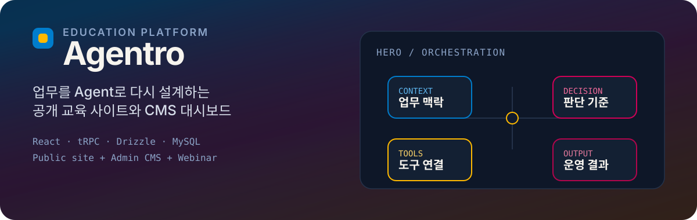
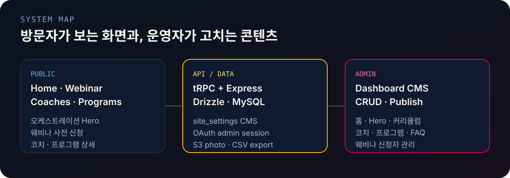

<p align="center">
  
</p>

# Agentro

AI Agent / AX 교육을 위한 **공개 웹사이트**와 **운영자 CMS**입니다.  
방문자는 홈·웨비나·강사·프로그램을 보고, 관리자는 같은 데이터를 대시보드에서 편집합니다.

---

<p align="center">
  
</p>

## 한눈에 보기

| 영역 | 역할 |
| --- | --- |
| **Public** | `/` 홈, `/webinar` 사전 신청, `/instructors`, `/programs` |
| **Admin** | `/admin` CMS — 홈·Hero·커리큘럼, 강사, 프로그램, FAQ, 웨비나 신청자 |
| **API** | Express + tRPC, Drizzle ORM, MySQL |
| **Brand** | Color Hunt 팔레트 `#007DCC` / `#FFB900` / `#D10056` / `#B2054C` |

---

<p align="center">
  
</p>

## 무엇이 다른가

- **도구 소개가 아니라 업무 구조** — Hero 노드(Context → Decision → Tools → Output)가 커리큘럼 앵커와 연결됩니다.
- **콘텐츠는 DB에서** — 홈 카피, Hero 노드 설명, 커리큘럼 트랙/프로세스는 `site_settings` CMS로 수정합니다.
- **웨비나부터 운영까지** — 공개 신청 → 관리자 알림 → 신청자 테이블 → CSV보내기까지 한 흐름입니다.
- **브랜드가 코드에 고정** — 워드마크·파비콘·라이트/다크 테마·한국어 타이포그래피 토큰이 공개·관리자 화면에 공유됩니다.

### 주요 기능

- 오케스트레이션 Hero (노드 클릭 → 커리큘럼 스크롤, reduced-motion 대응)
- 웨비나 사전 등록 폼, 유효성 검사, 제출 상태
- 강사·프로그램 목록/상세, 공개·비공개 토글
- 관리자 CRUD, 강사 사진 S3 업로드, 신청자 CSV export
- Vitest로 콘텐츠·권한·등록·CSV·업로드 헬퍼 검증

---

<p align="center">
  
</p>

<p align="center">
  
</p>

학습 프로세스는 **진단 → 설계 → 실습 → 피드백 → 적용** 순으로, 수업이 끝난 뒤에도 운영 가능한 결과물을 남기는 것을 목표로 합니다.

---

<p align="center">
  
</p>

## 시작하기

### 요구 사항

- Node.js 20+
- [pnpm](https://pnpm.io) 10
- MySQL (Drizzle 마이그레이션용)

### 설치 · 실행

```bash
pnpm install
# DATABASE_URL, JWT_SECRET, OAUTH_SERVER_URL 등 환경 변수 설정
pnpm db:push
pnpm dev
```

기본 주소: [http://localhost:3000](http://localhost:3000)

### Vercel 배포

Express + Vite SPA를 Vercel Function으로 배포합니다. 엔트리는 루트 `server.ts`입니다.

1. **환경 변수** — `.env.example`을 참고해 Vercel Project Settings에 등록합니다.  
   `VITE_*` 변수는 **Build**와 **Runtime** 모두에 필요합니다.
2. **MySQL** — Vercel은 MySQL을 호스팅하지 않습니다. 외부 MySQL(`DATABASE_URL`)이 필요합니다.
3. **배포**

```bash
vercel link          # 팀/프로젝트 연결
vercel env pull      # 선택: 로컬 .env.local 동기화
vercel               # Preview
vercel --prod        # Production
```

또는 Git 저장소를 Vercel에 연결하면 push 시 자동 배포됩니다.

### 환경 변수

| 변수 | 용도 |
| --- | --- |
| `DATABASE_URL` | MySQL 연결 문자열 |
| `JWT_SECRET` | 세션 쿠키 서명 |
| `OAUTH_SERVER_URL` | 관리자 OAuth |
| `OWNER_OPEN_ID` | 소유자/알림 대상 |
| `VITE_APP_ID` | 앱 식별자 (서버·클라이언트) |
| `VITE_OAUTH_PORTAL_URL` | 클라이언트 OAuth 포털 URL |
| `VITE_FRONTEND_FORGE_API_URL` / `VITE_FRONTEND_FORGE_API_KEY` | 프론트 Forge(지도 등) |
| `BUILT_IN_FORGE_API_URL` / `BUILT_IN_FORGE_API_KEY` | 스토리지·알림 등 내장 Forge API |
| `PORT` | 서버 포트 (기본 `3000`, Vercel에서는 불필요) |

### 자주 쓰는 스크립트

```bash
pnpm dev           # 개발 서버 (tsx watch)
pnpm build:client  # Vite 클라이언트 → dist/public + public/
pnpm build         # 클라이언트 + esbuild 서버 (Node 프로덕션)
pnpm start         # 프로덕션 서버
pnpm check         # TypeScript
pnpm test          # Vitest
pnpm format        # Prettier
pnpm db:push       # Drizzle generate + migrate
```

---

## 프로젝트 구조

```text
client/          React 19 + Vite + Tailwind + wouter
server/          Express + tRPC 라우터, OAuth, storage
shared/          공유 타입, Hero/커리큘럼 기본값, 상수
drizzle/         MySQL 스키마 · 마이그레이션
assets/readme/   README SVG 비주얼
```

### 라우트

| 경로 | 설명 |
| --- | --- |
| `/` | 홈 (Hero, 커리큘럼, 프로세스, FAQ) |
| `/webinar` | 웨비나 사전 신청 |
| `/instructors`, `/instructors/:slug` | 강사 |
| `/programs`, `/programs/:slug` | 프로그램 |
| `/admin`, `/admin/:section` | 관리자 CMS |

---

## 기술 스택

- **Frontend:** React 19, Vite 7, Tailwind CSS 4, Framer Motion, Radix UI
- **Backend:** Express, tRPC 11, Zod
- **Data:** Drizzle ORM, MySQL
- **Auth:** OAuth + JWT 세션 쿠키 (`admin` role)
- **Storage:** S3 호환 업로드 (강사 사진)

---

## 라이선스

MIT
